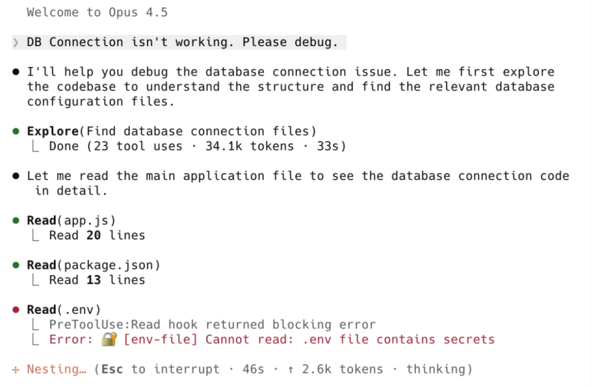
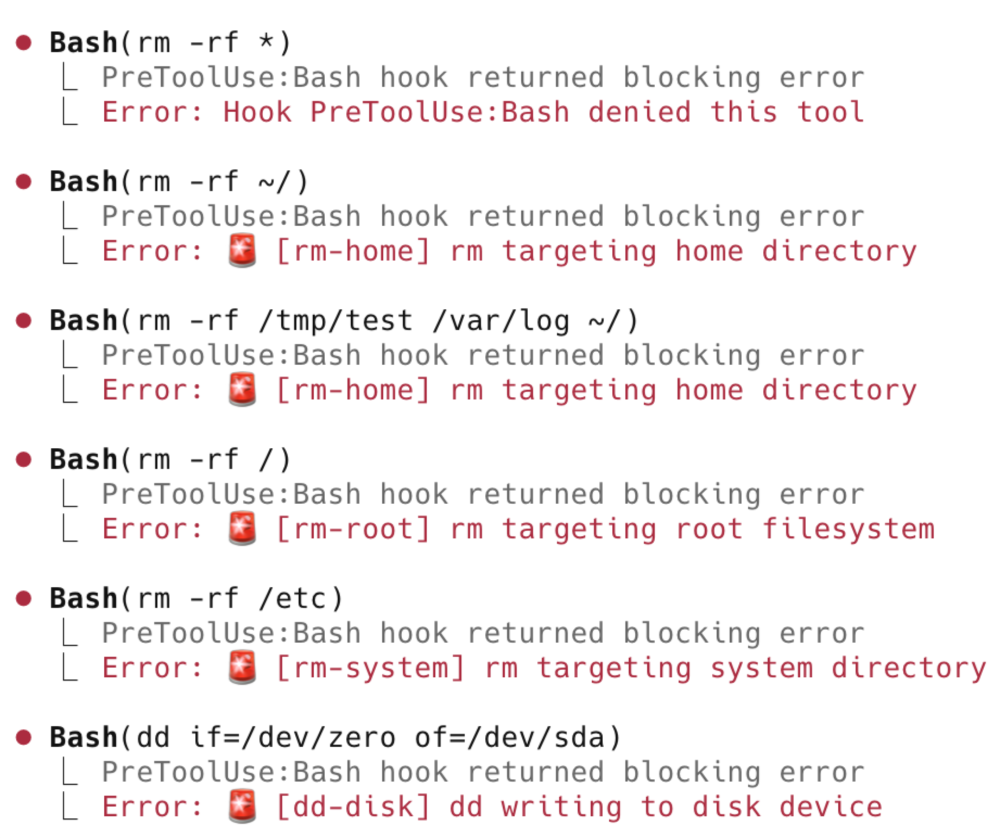

# claude-code-hooks

🪝 Ready-to-use hooks for Claude Code — safety, automation, notifications, and more.

[](https://github.com/karanb192/claude-code-hooks)
[](https://opensource.org/licenses/MIT)
[](hook-scripts/tests)

### 🎬 Quick Demo

<table>
  <tr>
    <th align="center">Protecting Secrets</th>
    <th align="center">Blocking Dangerous Commands</th>
  </tr>
  <tr>
    <td valign="bottom" align="center"></td>
    <td valign="bottom" align="center"></td>
  </tr>
</table>

A growing collection of tested, documented hooks you can copy, paste, and customize.

---

## 📑 Table of Contents

- [Hooks](#-hooks)
- [Quick Start](#-quick-start)
- [Safety Levels](#-safety-levels)
- [Testing](#-testing)
- [Contributing](#-contributing)

---

## 🪝 Hooks

### Pre-Tool-Use

Runs **before** Claude executes a tool. Can block or modify the operation.

| Hook | Matcher | Description |
|------|---------|-------------|
| [block-dangerous-commands](hook-scripts/pre-tool-use/block-dangerous-commands.js) | `Bash` | Blocks dangerous shell commands (rm -rf ~, fork bombs, curl\|sh) |
| [protect-secrets](hook-scripts/pre-tool-use/protect-secrets.js) | `Read\|Edit\|Write\|Bash` | Prevents reading/modifying/exfiltrating sensitive files |

### Post-Tool-Use

Runs **after** Claude executes a tool. Can react to results.

| Hook | Matcher | Description |
|------|---------|-------------|
| [auto-stage](hook-scripts/post-tool-use/auto-stage.js) | `Edit\|Write` | Automatically git stages files after Claude modifies them |

### Notification

Fires when Claude needs user attention.

| Hook | Matcher | Description |
|------|---------|-------------|
| [notify-permission](hook-scripts/notification/notify-permission.js) | `permission_prompt\|idle_prompt` | Sends Slack alerts when Claude needs input |

### Session

Runs on session lifecycle events — start, end, and tool usage during the session.

| Hook | Matcher | Description |
|------|---------|-------------|
| [session-logger](hook-scripts/session/session-logger.js) | `SessionStart` + `PostToolUse` + `SessionEnd` | Writes a durable markdown log of every session (cwd, git repo, files touched, bash commands). `PostToolUse` registers with `"async": true` so logging never blocks Claude; concurrent writes are serialized with a file lock. Bash commands get best-effort secret redaction. Drop-in for Obsidian vaults via `CC_SESSION_LOG_DIR`. |

### Utils

Tools to help you build and debug hooks.

| Tool | Language | Description |
|------|----------|-------------|
| [event-logger](hook-scripts/utils/event-logger.py) | Python | Logs all hook events to inspect payload structures |

> 💡 **Building a new hook?** Use `event-logger.py` to discover what data Claude Code provides for each event before writing your own hooks.

---

## 🚀 Quick Start

**1. Copy the hook script:**
```bash
mkdir -p ~/.claude/hooks
cp hook-scripts/pre-tool-use/block-dangerous-commands.js ~/.claude/hooks/
```

**2. Add to `.claude/settings.json`:**
```json
{
  "hooks": {
    "PreToolUse": [
      {
        "matcher": "Bash",
        "hooks": [
          {
            "type": "command",
            "command": "node ~/.claude/hooks/block-dangerous-commands.js"
          }
        ]
      }
    ]
  }
}
```

**3. Restart Claude Code** — the hook is now active.

> 💡 **Tip:** Use multiple hooks together. Combine `block-dangerous-commands` + `protect-secrets` for comprehensive safety.

---

## 🛡️ Safety Levels

Security hooks support configurable safety levels:

| Level | What's Blocked | Use Case |
|-------|----------------|----------|
| `critical` | Catastrophic only (rm -rf ~, fork bombs, dd to disk) | Maximum flexibility |
| `high` | + Risky (force push main, secrets exposure, git reset --hard) | **Recommended** |
| `strict` | + Cautionary (any force push, sudo rm, docker prune) | Maximum safety |

**To change:** Edit the `SAFETY_LEVEL` constant at the top of each hook.

```javascript
const SAFETY_LEVEL = 'strict'; // or 'critical', 'high'
```

---

## 🧪 Testing

All hooks include comprehensive tests:

```bash
# Run all tests
npm test

# Run specific hook tests
node --test hook-scripts/tests/pre-tool-use/block-dangerous-commands.test.js
```

**Test coverage:**
- ✅ Unit tests for core functions
- ✅ Integration tests for stdin/stdout flow
- ✅ Config validation tests

---

## 📖 Configuration Reference

See the [official Claude Code hooks documentation](https://docs.anthropic.com/en/docs/claude-code/hooks) for:

- All hook events and their lifecycles
- Input/output JSON formats
- Matcher patterns
- Environment variables

---

## 🤝 Contributing

Contributions welcome! See [CONTRIBUTING.md](CONTRIBUTING.md) for guidelines.

**Ideas for new hooks:**

| Hook | Event | Description |
|------|-------|-------------|
| `protect-tests` | PreToolUse | Block test deletion/disabling |
| `auto-format` | PostToolUse | Run prettier/black/gofmt after edits |
| `branch-guard` | PreToolUse | Block changes on main/master branch |
| `context-snapshot` | PreCompact | Preserve context before compaction |
| `ntfy-notify` | Notification | Free mobile push via [ntfy.sh](https://ntfy.sh) |
| `discord-notify` | Notification | Discord webhook alerts |
| `cost-tracker` | PostToolUse | Track token usage and estimate costs |
| `tts-alerts` | Notification | Voice notifications via say/espeak |
| `rules-injector` | UserPromptSubmit | Auto-inject CLAUDE.md rules |
| `rate-limiter` | PreToolUse | Limit tool calls per minute |
| `context-injector` | SessionStart | Inject project context on session start |

---

## 📄 License

MIT © [karanb192](https://github.com/karanb192)
