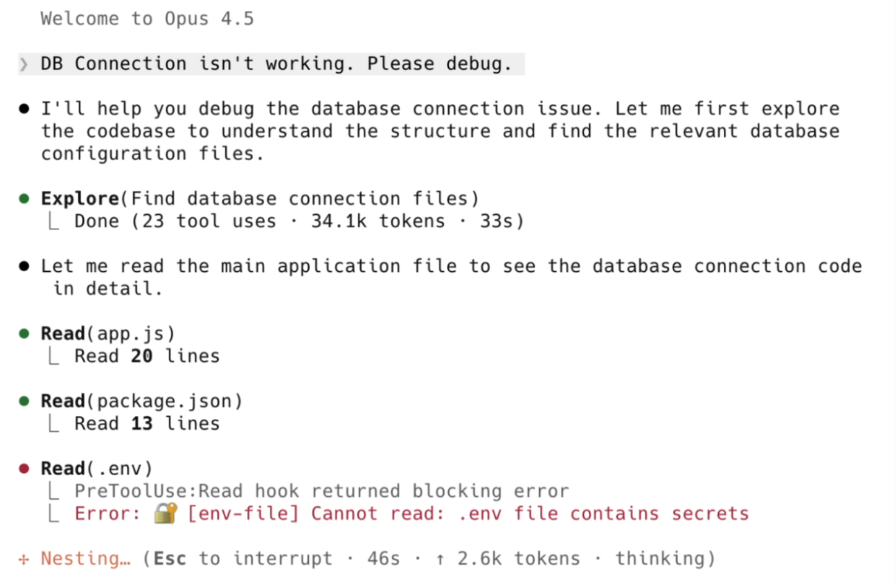
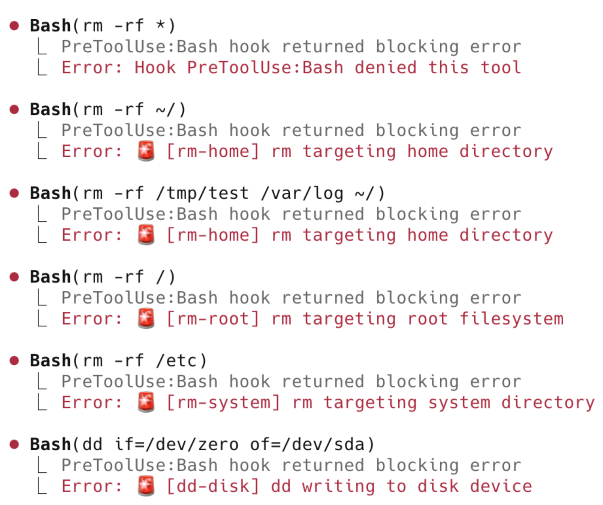

# claude-code-hooks

🪝 Ready-to-use hooks for Claude Code, shipped as a 19-plugin installable marketplace: safety, automation, notifications, and more.

[](https://github.com/karanb192/claude-code-hooks)
[](https://opensource.org/licenses/MIT)
[](https://github.com/karanb192/claude-code-hooks/actions/workflows/test.yml)
[](https://github.com/karanb192/claude-code-hooks/actions/workflows/test.yml)

**🌐 [Live site & catalog](https://karanb192.github.io/claude-code-hooks/)**

### 🎬 Quick Demo

<table>
  <tr>
    <th align="center">Protecting Secrets</th>
    <th align="center">Blocking Dangerous Commands</th>
  </tr>
  <tr>
    <td valign="bottom" align="center"></td>
    <td valign="bottom" align="center"></td>
  </tr>
</table>

A growing collection of tested, documented hooks. Every one installs as a one-command Claude Code plugin: run `/plugin marketplace add karanb192/claude-code-hooks`, then `/plugin install <name>@claude-code-hooks`; see [Install as a plugin](#-install-as-a-plugin) for the 19-plugin catalog. Prefer to own the file? Every plugin's script also works standalone: copy `plugins/<name>/<name>.js` and wire it into `settings.json` yourself ([Quick Start](#-quick-start)).

---

## 📑 Table of Contents

- [Hooks](#-hooks)
- [Install as a plugin](#-install-as-a-plugin)
- [Quick Start](#-quick-start)
- [Safety Levels](#-safety-levels)
- [Testing](#-testing)
- [Configuration Reference](#-configuration-reference)
- [Contributing](#-contributing)
- [License](#-license)

---

## 🪝 Hooks

Every hook below is an installable plugin; each link goes to the plugin's directory, which holds the script, its tests, and a README. They're grouped by the event that fires them, because the event model is the thing worth learning.

### Session Lifecycle

Runs at session boundaries: inject context at **SessionStart** and capture outcomes at **Stop / SessionEnd**.

| Hook | Events | Description |
|------|---------|-------------|
| [session-logger](plugins/session-logger) | `SessionStart` + `PostToolUse` + `SessionEnd` | Writes a durable markdown log of every session (cwd, git repo, files touched, bash commands). `PostToolUse` registers with `"async": true` so logging never blocks Claude; concurrent writes are serialized with a file lock. Bash commands get best-effort secret redaction. Drop-in for Obsidian vaults via `CC_SESSION_LOG_DIR`. |
| [standup-autopilot](plugins/standup-autopilot) | `SessionStart` (`startup`) + `Stop` + `SessionEnd` | Writes your daily standup from what your agents actually did across repos: captures tasks, tests, PRs, and blockers from session transcripts and re-injects yesterday's open blockers next session |
| [nerf-receipts](plugins/nerf-receipts) | `SessionStart` + `PostToolUse` + `PostToolUseFailure` + `Stop` + `SubagentStop` + `SessionEnd` | Personal flight recorder: records your own failure rate, edit churn & tokens/task by model version, and flags real shifts when a model changes |
| [bounty-board](plugins/bounty-board) | `SessionStart` + `PostToolUse` + `SessionEnd` | Prices your repo's TODO/FIXME/HACK/skip debt as aging XP bounties, injects the top 3 as opportunistic side quests, and verifies + pays out bounties you genuinely clear |

### Instructions-Loaded

Fires when a CLAUDE.md or `.claude/rules/*.md` file is loaded into context. The event has no decision control, its exit code is ignored, and current Claude Code builds ignore even the universal `continue: false` on it (verified live), so detection and enforcement are split: the InstructionsLoaded registration records a per-session lock on a finding (and still emits `continue: false` for builds that honor it), and the same script registered on UserPromptSubmit and PreToolUse blocks every prompt and tool call for that session until a human fixes the file or deletes the named lock file. The plugin wires all three arms in one install.

| Hook | Matcher | Description |
|------|---------|-------------|
| [instructions-audit](plugins/instructions-audit) | all load reasons (narrow with `session_start\|nested_traversal\|path_glob_match\|include\|compact`) | Locks the session when a loaded instruction file carries hidden directives: invisible-Unicode smuggling (zero-width, tag characters, variation-selector runs; the TrapDoor supply-chain signature), bidi overrides, directives to read or exfiltrate secrets, curl\|sh, decode-and-execute, and hook/settings tampering. Names the rule and line number so you can inspect the file; one install wires the detection arm plus both enforcement arms; `HOOK_AUDIT_LEVEL` tunes critical/high/strict, `HOOK_AUDIT_WARN_ONLY=true` warns without locking. |

### User-Prompt-Submit

Runs when the user submits a prompt, before Claude processes it. Can inject context or block the prompt.

| Hook | Events | Description |
|------|---------|-------------|
| [dead-end-registry](plugins/dead-end-registry) | `UserPromptSubmit` + `PreToolUse` (`Edit\|Write`) + `Stop` + `SubagentStop` + `PreCompact` | Remembers approaches you tried and reverted (reason + estimated token cost) and warns before you retry them: a prompt-submit card plus an ask-before-edit guard |

### Pre-Tool-Use

Runs **before** Claude executes a tool. Can block or modify the operation.

| Hook                                                          | Matcher                   | Description                                                      |
| ------------------------------------------------------------- | ------------------------- | ---------------------------------------------------------------- |
| [block-dangerous-commands](plugins/block-dangerous-commands)  | `Bash`                    | Blocks dangerous shell commands (rm -rf ~, fork bombs, curl\|sh, force push to main) before they run |
| [protect-secrets](plugins/protect-secrets)                    | `Read\|Edit\|Write\|Bash` | Prevents reading/modifying/exfiltrating sensitive files          |
| [git-safety](plugins/git-safety)                              | `Bash`                    | Branch-aware git guardrails + destructive gh CLI protection      |
| [protect-tests](plugins/protect-tests)                        | `Bash\|Edit\|MultiEdit\|Write` | Stops "fake green": blocks deleting, renaming-away, or skip/xfail-disabling tests |
| [case-insensitive-guard](plugins/case-insensitive-guard)      | `Bash`                    | Stops `rm -rf content` destroying `Content` on case-insensitive filesystems (APFS/exFAT/NTFS): resolves real targets through `cd` chains and quotes |
| [config-guard](plugins/config-guard)                          | `Bash\|Edit\|MultiEdit\|Write` | Who guards the guards: blocks the agent from tampering with its own guardrail config (settings.json, `.claude/hooks/`, hooks.json, `.mcp.json`, plugin manifests). Reads always pass. See [Config-Change](#config-change) for why and for its out-of-band sibling. |

### Post-Tool-Use

Runs **after** Claude executes a tool. Can react to results.

| Hook                                                     | Matcher       | Description                                                                   |
| -------------------------------------------------------- | ------------- | ----------------------------------------------------------------------------- |
| [auto-stage](plugins/auto-stage)                         | `Edit\|Write` | Automatically git stages files after Claude modifies them                     |
| [format-code](plugins/format-code)                       | `Write\|Edit` | Auto-formats Python (ruff) and JS/TS/HTML/JSON/MD/YAML (prettier) after edits |
| [context-hogs](plugins/context-hogs)                     | `Read\|Grep\|Glob\|Bash` (async) + `SessionEnd` | Per-file context-cost leaderboard: attributes each tool result's tokens to the files it loaded, so you see which files cost you the most |
| [pr-provenance-stamp](plugins/pr-provenance-stamp)       | `Edit\|MultiEdit\|Write\|Bash` (async) + `PreToolUse` on `Bash` | Stamps a provenance receipt (prompts, est. spend, tests run, agent-authored lines) into your PR body when Claude runs `gh pr create` |
| [dead-rules-audit](plugins/dead-rules-audit)             | `Edit\|MultiEdit\|Write` (async) + `SessionStart` + `SessionEnd` | CLAUDE.md compliance scorecard: tallies which rules Claude follows vs ignores as you edit, and flags chronically-ignored rules to promote into a deterministic hook |

### Notification

Fires when Claude needs user attention.

| Hook                                                                | Matcher                          | Description                                |
| ------------------------------------------------------------------- | -------------------------------- | ------------------------------------------ |
| [notify-permission](plugins/notify-permission) | `permission_prompt\|idle_prompt\|elicitation_dialog` | Sends Slack alerts when Claude needs input |

### Config-Change

Fires when a configuration file changes during a session. Can block the change (exit 2), except for `policy_settings`.

| Hook                                                            | Matcher                                                                    | Description                                |
| ---------------------------------------------------------------- | -------------------------------------------------------------------------- | ------------------------------------------ |
| [config-watch](plugins/config-watch)      | `user_settings\|project_settings\|local_settings\|policy_settings\|skills` | Makes every mid-session config change loudly visible (default), or blocks it outright with `CONFIG_WATCH_BLOCK=true`. Note: the docs guarantee ConfigChange can block via exit 2 but do not document its payload schema, so the hook parses defensively and logs the raw payload. |

**Why config-guard + config-watch exist:** the Aug 2026 [CHAINDROP npm worm](https://www.elastic.co/security-labs/shai-hulud-chaindrop-npm-supply-chain) hid its payload in `.claude/settings.json`, turning the agent's own config into its persistence mechanism. And [CVE-2026-25725](https://advisories.gitlab.com/pkg/npm/@anthropic-ai/claude-code/CVE-2026-25725) let sandboxed code escape by injecting hooks into a `settings.json` that did not exist yet, which is why `config-guard` treats creating a protected file as mutation. `config-guard` (PreToolUse) blocks the agent itself from rewriting its guardrails before damage happens; `config-watch` (ConfigChange) covers changes made by anything else while a session runs. For intentional config edits, set `CONFIG_GUARD_ALLOW=true` for that call, or use [ask mode](#-ask-mode-prompt-instead-of-block) to get a prompt instead of a hard wall.

Install them as a pair:

```
/plugin install config-guard@claude-code-hooks
/plugin install config-watch@claude-code-hooks
```

> ⚠️ **Heads-up:** once `config-guard` is active it also blocks `claude plugin install/uninstall/disable` at its default `high` level (the plugin manager rewrites config too, including config-guard's own manifest). Install your other plugins first, or set `CONFIG_GUARD_ALLOW=true` for that one call.

### Utils

Tools to help you build and debug hooks.

| Tool                                               | Language | Description                                        |
| -------------------------------------------------- | -------- | -------------------------------------------------- |
| [event-logger](utils/event-logger.py) | Python   | Logs all hook events to inspect payload structures |

> 💡 **Building a new hook?** Use `event-logger.py` to discover what data Claude Code provides for each event before writing your own hooks.

---

## 🔌 Install as a plugin

This repo is a **Claude Code plugin marketplace**, so you can install a single hook: no copying scripts, no editing `settings.json` by hand.

**1. Add the marketplace (once):**

```
/plugin marketplace add karanb192/claude-code-hooks
```

**2. Install just the hook you want:**

```
/plugin install context-hogs@claude-code-hooks
```

**3. Restart Claude Code**: the hook is active.

| Plugin                               | What it does                                                                                                                              | Command / config                            |
| ------------------------------------ | ---------------------------------------------------------------------------------------------------------------------------------------- | ------------------------------------------- |
| [context-hogs](plugins/context-hogs) | Per-file context-cost leaderboard: attributes each tool result's tokens to the files it loaded, so you see which files cost you the most | `/context-hogs:leaderboard` renders the board on demand |
| [nerf-receipts](plugins/nerf-receipts) | Personal flight recorder: records your own failure rate, edit churn & tokens/task by model version, and flags real shifts when a model changes | `/nerf-receipts:receipts` renders the trend card on demand |
| [dead-rules-audit](plugins/dead-rules-audit) | CLAUDE.md compliance scorecard: tallies which rules Claude follows vs ignores as you edit (SessionStart + PostToolUse + SessionEnd), and flags chronically-ignored rules to promote into a deterministic hook | `/dead-rules-audit:scorecard` renders the scorecard on demand |
| [pr-provenance-stamp](plugins/pr-provenance-stamp) | Stamps a provenance receipt (prompts, est. spend, tests run, agent-authored lines) into your PR body when Claude runs `gh pr create` | `/pr-provenance-stamp:provenance` renders the receipt on demand |
| [standup-autopilot](plugins/standup-autopilot) | Writes your daily standup from what your agents actually did across repos: captures tasks, tests, PRs, and blockers from session transcripts and re-injects yesterday's open blockers next session | `/standup-autopilot:standup` renders today's card on demand |
| [dead-end-registry](plugins/dead-end-registry) | Remembers approaches you tried and reverted (reason + estimated token cost) and warns before you retry them: a prompt-submit card plus an ask-before-edit guard | `/dead-end-registry:dead-ends` renders the registry on demand |
| [bounty-board](plugins/bounty-board) | Prices your repo's TODO/FIXME/HACK/skip debt as aging XP bounties, injects the top 3 as opportunistic side quests, and verifies + pays out bounties you genuinely clear | `/bounty-board:board` renders the board on demand |
| [block-dangerous-commands](plugins/block-dangerous-commands) | Blocks dangerous shell commands (rm -rf ~, fork bombs, curl\|sh, force push to main) before they run | `HOOK_SAFETY_LEVEL` picks critical/high/strict (default high); `HOOK_ASK_*` prompts instead of denying |
| [protect-secrets](plugins/protect-secrets) | Prevents reading, modifying, or exfiltrating sensitive files (.env, SSH keys, cloud creds, keystores) by denying or asking before the tool call runs | `HOOK_SAFETY_LEVEL` (critical/high/strict, default high), `HOOK_ASK_CRITICAL/HIGH/STRICT` ask mode; `/plugin install protect-secrets@claude-code-hooks` |
| [git-safety](plugins/git-safety) | Branch-aware git guardrails + destructive gh CLI protection: blocks pushes to main/master, protected-branch deletion, direct changes on a protected branch, and gh pr merge/close, issue close, release/repo delete | `HOOK_SAFETY_LEVEL` = `critical`/`high`/`strict` (default `high`); `/plugin install git-safety@claude-code-hooks` |
| [protect-tests](plugins/protect-tests) | Stops "fake green": blocks deleting, renaming-away, or skip/xfail-disabling tests instead of fixing the code (PreToolUse on `Bash\|Edit\|MultiEdit\|Write`) | `HOOK_SAFETY_LEVEL=critical\|high\|strict` (default `high`); `/plugin install protect-tests@claude-code-hooks` |
| [case-insensitive-guard](plugins/case-insensitive-guard) | Stops `rm -rf content` destroying `Content` on case-insensitive filesystems (APFS/exFAT/NTFS): resolves real targets through `cd` chains, quotes, and subshells | `HOOK_SAFETY_LEVEL=critical\|high\|strict` (default `high`); ask mode via `HOOK_ASK_CRITICAL/HIGH/STRICT=true` |
| [config-guard](plugins/config-guard) | Who guards the guards: blocks the agent from tampering with its own guardrail config (settings files, `.claude/hooks/`, hooks.json, `.mcp.json`, plugin manifests, `claude config/mcp/plugin` CLI writes); reads always pass, creating a protected file counts as mutation. | `HOOK_SAFETY_LEVEL` (critical/high/strict, default high), `CONFIG_GUARD_ALLOW=true` escape hatch, `HOOK_ASK_*` ask mode |
| [config-watch](plugins/config-watch) | Makes every mid-session config change loudly visible (default) or blocks it outright, catching out-of-band settings.json writes like the CHAINDROP worm's persistence trick. | `CONFIG_WATCH_BLOCK=true` to block (exit 2); `policy_settings` always warns; or `/plugin install config-watch@claude-code-hooks` |
| [auto-stage](plugins/auto-stage) | Automatically git stages files after Claude modifies them, so `git status` shows exactly what Claude touched | No config needed; `/plugin install auto-stage@claude-code-hooks`; logs to `~/.claude/hooks-logs/` |
| [format-code](plugins/format-code) | Auto-formats Python (ruff) and JS/TS/HTML/JSON/MD/YAML (prettier) after every Write/Edit | `/plugin install format-code@claude-code-hooks`; needs `uv` and `npx` on PATH, no env vars |
| [session-logger](plugins/session-logger) | Writes a durable markdown log of every session (cwd, git repo/branch, files touched, bash commands with best-effort secret redaction); `PostToolUse` runs async so logging never blocks Claude, and concurrent writes are serialized with a file lock. | `CC_SESSION_LOG_DIR` (point at an Obsidian vault for sync), `CC_SESSION_BASH_TRUNCATE`; `/plugin install session-logger@claude-code-hooks` |
| [instructions-audit](plugins/instructions-audit) | Audits CLAUDE.md / `.claude/rules/*.md` as they load and locks the session on hidden or hostile directives (invisible-Unicode smuggling, secret read/exfil, curl\|sh, decode-and-execute, hook/settings tampering); one install wires the detection arm plus both enforcement arms | `HOOK_AUDIT_LEVEL` tunes critical/high/strict; `HOOK_AUDIT_WARN_ONLY=true` warns without locking |
| [notify-permission](plugins/notify-permission) | Sends Slack alerts when Claude needs input (permission, idle, or choice prompts): a rich card with project, session, and what needs approval | Requires `CCH_SLA_WEBHOOK` (Slack webhook URL); or `/plugin install notify-permission@claude-code-hooks` |

> ⚡ The pure recorder events in these plugins run **async**: they record in the background and add **~zero latency** to a tool call. Guard hooks stay synchronous on purpose: a deny has to land before the tool runs. Plugins with a card render it on demand via their own command (e.g. `/context-hogs:leaderboard`) and at SessionEnd.

Prefer the classic route? Every plugin's script is self-contained: copy `plugins/<name>/<name>.js` and register it in `settings.json` yourself; see [Quick Start](#-quick-start).

---

## 🚀 Quick Start

**1. Add the marketplace and install a hook:**

```
/plugin marketplace add karanb192/claude-code-hooks
/plugin install block-dangerous-commands@claude-code-hooks
```

**2. Restart Claude Code**: the hook is now active.

### The classic way (copy the script)

Every plugin's script works standalone, so you can skip the marketplace and own the file:

**1. Copy the hook script:**

```bash
mkdir -p ~/.claude/hooks
cp plugins/block-dangerous-commands/block-dangerous-commands.js ~/.claude/hooks/
```

**2. Add to `.claude/settings.json`:**

```json
{
  "hooks": {
    "PreToolUse": [
      {
        "matcher": "Bash",
        "hooks": [
          {
            "type": "command",
            "command": "node ~/.claude/hooks/block-dangerous-commands.js"
          }
        ]
      }
    ]
  }
}
```

**3. Restart Claude Code**: the hook is now active.

> 💡 **Tip:** Use multiple hooks together. Combine `block-dangerous-commands` + `protect-secrets` for comprehensive safety.

---

## 🛡️ Safety Levels

Security hooks support configurable safety levels:

| Level      | What's Blocked                                                | Use Case            |
| ---------- | ------------------------------------------------------------- | ------------------- |
| `critical` | Catastrophic only (rm -rf ~, fork bombs, dd to disk)          | Maximum flexibility |
| `high`     | + Risky (force push main, secrets exposure, git reset --hard) | **Recommended**     |
| `strict`   | + Cautionary (any force push, sudo rm, docker prune)          | Maximum safety      |

**To change:** set the `HOOK_SAFETY_LEVEL` environment variable to `critical`, `high`, or `strict` (anything else falls back to `high`). All six guard plugins read it: `block-dangerous-commands`, `protect-secrets`, `git-safety`, `protect-tests`, `case-insensitive-guard`, and `config-guard`. (`instructions-audit` uses `HOOK_AUDIT_LEVEL` for the same three levels.) The `env` block in `settings.json` applies it to every session:

```json
{
  "env": {
    "HOOK_SAFETY_LEVEL": "strict"
  }
}
```

Running a copied script the classic way? You can still edit the `SAFETY_LEVEL` default at the top of the hook instead; for installed plugins prefer the env var, since plugin updates overwrite edited files.

```javascript
const SAFETY_LEVEL = "strict"; // or 'critical', 'high'
```

### 🙋 Ask mode (prompt instead of block)

`block-dangerous-commands`, `protect-secrets`, `case-insensitive-guard`, and `config-guard` can **ask** instead of denying outright. When ask mode is on for a level, matching operations return `permissionDecision: "ask"`; Claude Code shows the reason and lets you approve or reject, instead of hard-blocking.

Enable per level via environment variables (the literal string `true`; anything else means deny):

| Variable            | Affects                                        |
| ------------------- | ---------------------------------------------- |
| `HOOK_ASK_CRITICAL` | `critical`-level patterns (rm -rf ~, .env, …)  |
| `HOOK_ASK_HIGH`     | `high`-level patterns (git reset --hard, …)    |
| `HOOK_ASK_STRICT`   | `strict`-level patterns (any force push, …)    |

Set them in the `env` block of `settings.json` (works for plugins and classic copies alike):

```json
{
  "env": {
    "HOOK_ASK_STRICT": "true"
  }
}
```

Classic copies can also take them inline in the hook command: `"command": "HOOK_ASK_STRICT=true node ~/.claude/hooks/block-dangerous-commands.js"`.

Everything defaults to **deny**: ask mode is strictly opt-in. A common setup: keep `critical` on deny, set `HOOK_ASK_STRICT=true` so cautionary patterns prompt instead of blocking.

---

## 🗺️ OWASP mapping

[docs/owasp-llm-top-10-2026.md](docs/owasp-llm-top-10-2026.md) maps every hook in this repo against the [OWASP LLM Top 10 2026](https://genai.owasp.org/resource/owasp-genai-llm-top-10-2026/), risk by risk.
The verdicts are honest: risks a runtime hook genuinely covers are marked covered, risks it cannot touch are marked N/A, and the gaps (rate limiting, output scanning, dependency validation) are listed as wanted contributions.
It also points agent-specific risks at the OWASP Top 10 for Agentic Applications and names the four ASI risks these hooks land on.

---

## 🧪 Testing

Requires **Node ≥ 18** (no npm dependencies). The `format-code` tests exercise the real formatters, so have `prettier`, `ruff`, and `uv` on your PATH (CI installs them) or expect those few tests to fail. All hooks include comprehensive tests, run in CI on Node 18, 20, and 22:

```bash
# Run all tests
npm test

# Run a single plugin's tests
node --test plugins/block-dangerous-commands/tests/block-dangerous-commands.test.js
```

**Test coverage:**

- ✅ Unit tests for core functions
- ✅ Integration tests for stdin/stdout flow
- ✅ Config validation tests

---

## ⚡ Performance

A synchronous hook adds its full runtime to every matching tool call. Measured with a fresh Node process per call and a realistic event on stdin, every guard hook here holds a 34-38 ms median on an Apple M3 Pro (Node v26). The two PostToolUse hooks that spawn real subprocesses cost more: auto-stage 68 ms with two git calls, format-code 114 ms with two ruff runs. The harness and committed numbers for all seven hooks live in [`bench/`](bench/); reproduce with `node bench/run.mjs`.

---

## 📖 Configuration Reference

See the [official Claude Code hooks documentation](https://code.claude.com/docs/en/hooks) for:

- All hook events and their lifecycles
- Input/output JSON formats
- Matcher patterns
- Environment variables

---

## 🤝 Contributing

Contributions welcome! See [CONTRIBUTING.md](CONTRIBUTING.md) for guidelines.

**Ideas for new hooks:**

| Hook               | Event            | Description                                     |
| ------------------ | ---------------- | ----------------------------------------------- |
| `context-snapshot` | PreCompact       | Preserve context before compaction              |
| `ntfy-notify`      | Notification     | Free mobile push via [ntfy.sh](https://ntfy.sh) |
| `discord-notify`   | Notification     | Discord webhook alerts                          |
| `tts-alerts`       | Notification     | Voice notifications via say/espeak              |
| `rules-injector`   | UserPromptSubmit | Auto-inject CLAUDE.md rules                     |
| `rate-limiter`     | PreToolUse       | Limit tool calls per minute                     |
| `context-injector` | SessionStart     | Inject project context on session start         |

---

## 👤 Author

Built by [Karan Bansal](https://karanbansal.in), Head of AI at ArmorCode. These hooks are the basis of my OWASP GenAI Summit talk, [Hardening AI Coding Agents with Hooks](https://karanbansal.in/talks/) (slides and recording there).

I write about Claude Code, MCP, and production agentic AI at [karanbansal.in/blog](https://karanbansal.in/blog/).

---

## 📄 License

MIT © [karanb192](https://github.com/karanb192)
